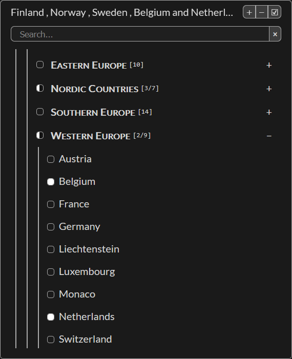

# Multi-Selector Web Component

A lightweight, accessible web component for selecting multiple options from hierarchical data structures. Built with vanilla JavaScript and no external dependencies. Check out [this page](https://lcvriend.github.io/wc-multi-selector/) for several examples.



## Features

- **Hierarchical Data**: Support for arbitrarily nested option groups
- **Multiple Data Sources**: Load from JSON or define options in HTML markup
- **Advanced Search**: Filter by labels or values with instant results
- **Keyboard Navigation**: Full keyboard accessibility with intuitive shortcuts
- **Form Integration**: Native form participation with proper validation
- **Adaptive Theming**: Automatic dark/light mode detection with custom styling
- **Accessibility**: WCAG compliant with proper ARIA attributes and focus management

## Quick Start

```html
<!-- Basic usage with JSON data -->
<multi-selector src="data/options.json" name="my-options"></multi-selector>

<!-- Inline options -->
<multi-selector name="colors">
    <option>Red</option>
    <option>Blue</option>
    <option>Green</option>
</multi-selector>

<!-- Grouped options -->
<multi-selector name="instruments">
    <optgroup label="String">
        <option value="guitar">Guitar</option>
        <option value="violin">Violin</option>
    </optgroup>
    <optgroup label="Wind">
        <option value="flute">Flute</option>
        <option value="trumpet">Trumpet</option>
    </optgroup>
</multi-selector>
```

## Installation

Simply include the JavaScript file in your HTML:

```html
<script src="wc-multi-selector.js"></script>
```

The component automatically registers itself as `<multi-selector>`.

## Data Structure

### JSON Format

Each option should follow this structure:

```json
{
    "label": "Display Text",     // Optional - falls back to value
    "value": "unique_id",        // Required
    "selected": false,           // Optional - preselect option
    "children": []               // Optional - for nested groups
}
```

### Simplified Formats

The component automatically converts simpler formats:

```json
// Flat array
["Option 1", "Option 2", "Option 3"]

// Nested object
{
    "Group A": ["Item 1", "Item 2"],
    "Group B": ["Item 3", "Item 4"]
}
```

## API Reference

### Attributes

| Attribute     | Type              | Description |
|---------------|-------------------|-------------|
| `src`         | string            | URL to JSON data source |
| `name`        | string            | Form field name |
| `placeholder` | string            | Text shown when no selections made |
| `disabled`    | boolean           | Disable the component |
| `mode`        | "light" \| "dark" | Force theme mode (auto-detects if not set) |

### Properties

| Property         | Type   | Description |
|------------------|--------|-------------|
| `data`           | Array  | Get/set the options data |
| `selectedValues` | Array  | Array of currently selected values |
| `selectedLabels` | Array  | Array of currently selected labels |
| `settings`       | Object | Component configuration options |

### Methods

| Method                   | Parameters | Description |
|--------------------------|------------|-------------|
| `addSelectedValues()`    | ...values  | Add values to selection |
| `removeSelectedValues()` | ...values  | Remove values from selection |

### Events

| Event    | Detail                     | Description |
|----------|----------------------------|-------------|
| `change` | `{detail: selectedValues}` | Fired when selection changes |

## Keyboard Shortcuts

### Navigation
- `↑` `↓` `←` `→` - Navigate options
- `Home` / `End` - Jump to first/last option
- `Tab` - Standard tab navigation
- `Esc` - Close dropdown

### Filtering & Folding
- `Ctrl` + `\` - Show only selected items
- `Ctrl` + `/` - Clear search filter
- `Ctrl` + `[` - Fold all groups
- `Ctrl` + `]` - Unfold all groups

## Styling

### CSS Custom Properties

The component uses CSS custom properties for theming:

```css
multi-selector {
    /* Layout */
    --ms-height: calc(2rem + var(--ms-padding-block));
    --ms-max-height: 60vh;
    --ms-padding-block: .25em;
    --ms-padding-inline: 1em;
    --ms-border-radius: 5px;

    /* Colors */
    --ms-text-color: inherit;
    --ms-border-color: currentColor;
    --ms-dropdown-background: hsl(0, 0%, 100%);
    --ms-hover: hsl(0, 0%, 93%);
}
```

### Shadow Parts

Use `::part()` selectors for structural styling:

```css
multi-selector::part(container) {
    border-width: 2px;
    box-shadow: 0 4px 12px rgba(0, 0, 0, 0.3);
}

multi-selector::part(dropdown) {
    background: var(--custom-background);
}
```

Available parts:
- `container` - Main dropdown container
- `display` - Selected items display
- `controls` - Control button panel
- `dropdown` - Dropdown content area
- `filter` - Search section
- `options` - Options container

## Form Integration

The component participates in forms like native controls:

```html
<form>
    <multi-selector name="preferences" src="data.json"></multi-selector>
    <button type="submit">Submit</button>
</form>
```

Form data is submitted as a JSON string of selected values.

## Advanced Usage

### Dynamic Data Management

```javascript
const selector = document.querySelector('multi-selector')

// Set data programmatically
selector.data = [
    { label: "Option 1", value: "opt1" },
    { label: "Option 2", value: "opt2" }
]

// Listen for changes
selector.addEventListener('change', event => {
    console.log('Selected:', event.detail)
})

// Programmatically select options
selector.addSelectedValues('opt1', 'opt2')
```

### Custom Settings

```javascript
selector.settings = {
    labels: {
        placeholder: "Choose items...",
        filter: {
            placeholder: "Type to search..."
        }
    },
    titles: {
        unfoldGroups: "Expand all groups",
        showSelected: "Show selected only"
    }
}

// Extend defaults
MultiSelector.defaultSettings.labels.all = "Alle items"
```

## Alternatives

- [BVSelect](https://bmsvieira.github.io/BVSelect-VanillaJS/)
- [vanilla-select](https://vorotina.github.io/vanilla-select/)
- [multiselect-combo-box](https://multiselect-combo-box.web.app/)
