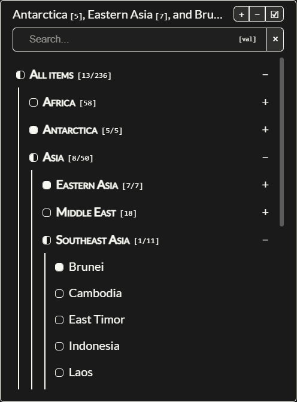

# multi-selector (web component)



`<multi-selector>` is a web component that lets a user select multiple options from a drop-down menu:

* Arbitrarily nested groups of options
* Searchable
* Easy to control and navigate (also with the keyboard)
* Reads options from JSON or mark up
* Supports dark mode
* Style with custom properties
* VanillaJS (no dependencies)

Check out [this page](https://lcvriend.github.io/wc-multi-selector/) for several examples.

## How to use
Load the `<multi-selector>` web component and add it to your page:

```html
<multi-selector
    src="data/countries.json"
    name="countries">
</multi-selector>
<script src="src/wc-multi-selector.js"></script>
```

### Attributes
The following attributes are available for customizing the component:

attribute     | description
--------------|-------------
`name`        | Name of the component
`placeholder` | Text when no value is set
`disabled`    | If set then component is non-interactive
`src`         | Path to data to embed

### Properties
The component also exposes the following properties:

property              | description
----------------------|-------------
`options`             | All options as array
`selectedValues`      | All selected values as array
`selectedLabels`      | All selected labels as array
`selectedLeastNested` | All selected groups and labels that are least nested

### Events
The component dispatches a `change` event whenever an option is (de)selected.

### Methods
The following methods are available:

method                          | description
--------------------------------|-----------------------------
addSelectedValues(...values)    | Add values to selection
removeSelectedValues(...values) | Remove values from selection

## Data
### Load from JSON
Supply the data as JSON using the src attribute of `<multi-selector>`.

The data should be provided in this format:

```json
{ "label": "label", "value": "value", "children": [] }
```

See [soaps.json](data/soaps.json) for an example. To preselect values add `"selected": true`. Note that only values can be selected, not categories.

It is also possible to provide the data as a nested object where the options are given as strings in an array. `<multi-selector>` will convert this to the format above.

See [countries.json](data/countries.json) for an example.

### Load from DOM
Populate `<multi-selector>` with markup by using `<option>` tags. `<multi-selector>` will assume that the value of an option is its text content unless a value attribute is supplied. Use the `selected` attribute to preselect a value.

Use `<optgroup>` tags to categorize options. Unlike the default `<optgroup>` tag, it can be nested.

Set labels and values with the label and value attributes. If not present labels and values will be set from the textContent.

## Keyboard navigation
### Opening and Closing
- **Enter/Space** on the closed selector opens the dropdown
- **Escape** closes the dropdown from anywhere within
- **Tab** navigates away and closes the dropdown

### General Navigation
- **Arrow Up/Down** - Navigate between focusable elements (summary, search, group headers, options)
- **Arrow Left/Right** - Navigate horizontally through control buttons and elements
- **Home** - Jump to the top (selector summary)
- **End** - Jump to the last focusable element in the dropdown

### Search and Filtering
- **Ctrl + \\** - Show only selected items (same as clicking the ✓ button)
- **Ctrl + /** - Clear search filter and show all items
- **Escape** in search box - Clear the current search term

### Group Management
- **Ctrl + ]** - Unfold/expand all groups
- **Ctrl + [** - Fold/collapse all groups
- **Enter/Space** on group headers - Toggle individual group expansion

### Selection
- **Space** on checkboxes - Toggle selection
- **Enter** on group checkboxes - Select/deselect entire group and children

## Styling

### CSS parts
The component exposes these CSS parts for styling with ::part():

- `container` - The main details element wrapper
- `display` - The selection display area showing current choices
- `controls` - The control button panel (fold/unfold/show-selected buttons)
- `control-button` - Individual control buttons
- `dropdown` - The dropdown container that appears when open
- `filter` - The search section wrapper
- `search` - The search input field
- `options` - The scrollable options container

```css
multi-selector::part(dropdown) { background: black; }
```

### Custom properties
Some simple styling is possible using custom properties. The following properties are available:

#### Layout & Spacing:

- `--ms-height` - Overall component height
- `--ms-max-height` - Maximum dropdown height
- `--ms-padding-block` - Vertical padding
- `--ms-padding-inline` - Horizontal padding
- `--ms-border-radius` - Border radius for rounded corners

#### Colors & Appearance:

- `--ms-primary-color` - Borders and outlines
- `--ms-accent-color` - Checkboxes and active states
- `--ms-dropdown-background` - Dropdown background
- `--ms-option-hover` - Hover state background

#### Typography:

- `--ms-text-color` - Main text color
- `--ms-search-text-color` - Search input text
- `--ms-search-placeholder-color` - Search placeholder text

## Labels
The following labels are customizable:
```js
{
    labels: {
        all: "All items",
        empty: "No options loaded...",
        placeholder: "options",
        selection: "Filtered items",
        filter: {
            placeholder: "Search...",
            allSelected: "<all selected>",
        }
    },
    titles: {
        unfoldGroups: "unfold groups: ctrl-]",
        foldGroups: "fold groups: ctrl-[",
        showSelected: "show selected: ctrl-\\",
        clearFilter: "clear filter",
    }
}
```

### Translations
There are three main ways to override the default labels:

1. Per instance after creation:
```js
const selector = document.querySelector('multi-selector')
selector.settings = {
    labels: { all: "Alle items" }
}
```

2. Global defaults before any instances:
```js
MultiSelector.defaultSettings = {
    labels: { all: "Alle items" }
}
```

3. Hybrid - extend defaults and set per instance:
```js
// Extend defaults
MultiSelector.defaultSettings.labels.all = "Alle items"

// Override specific instance
selector.settings = {
    titles: { unfold_groups: "Openvouwen" }
}
```
